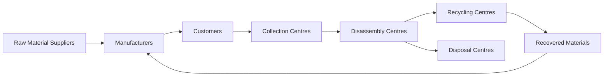
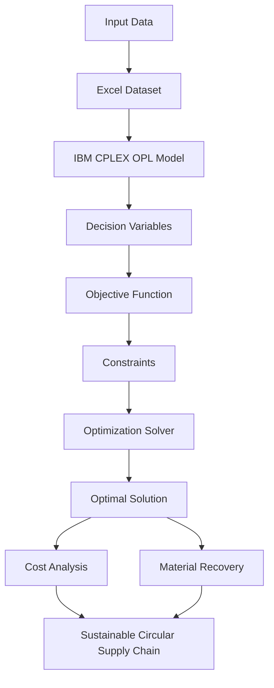

<div align="center">

# ♻️ WPCB Circular Supply Chain Optimization

### *A Mixed Integer Linear Programming (MILP) Model for Sustainable Electronic Waste Management*

<p align="center">


</p>

---

### 🌍 **Designing a Sustainable Closed-Loop Supply Chain for Waste Printed Circuit Boards using Mathematical Optimization**

*"Transforming electronic waste into valuable resources through optimization and circular economy principles."*

</div>

---

# 📖 Table of Contents

- [🌍 Project Overview](#-project-overview)
- [🎯 Objectives](#-objectives)
- [✨ Key Features](#-key-features)
- [🏗 Supply Chain Architecture](#-supply-chain-architecture)
- [🔄 Optimization Workflow](#-optimization-workflow)
- [📊 Mathematical Model](#-mathematical-model)
- [🛠 Technologies Used](#-technologies-used)
- [📂 Repository Structure](#-repository-structure)
- [🚀 Getting Started](#-getting-started)
- [📈 Model Outputs](#-model-outputs)
- [🌱 Real World Applications](#-real-world-applications)
- [🔮 Future Enhancements](#-future-enhancements)
- [📚 Research Reference](#-research-reference)
- [👨‍💻 Author](#-author)
- [⭐ Support](#-support)

---

# 🌍 Project Overview

Electronic waste (**E-Waste**) has become one of the fastest-growing waste streams worldwide. Among all electronic components, **Waste Printed Circuit Boards (WPCBs)** are particularly significant because they contain valuable metals such as copper, gold, silver, and palladium, along with hazardous materials that require proper treatment.

Traditional disposal methods lead to:

- ❌ Environmental pollution
- ❌ Resource depletion
- ❌ High landfill dependency
- ❌ Loss of valuable recoverable materials

This project presents a **Mixed Integer Linear Programming (MILP)** optimization model that designs an efficient **Closed-Loop Circular Supply Chain** for Waste Printed Circuit Boards.

The optimization model determines the most cost-effective movement of materials across different supply chain entities while maximizing recycling, recovery, and sustainability.

---

# 🎯 Objectives

The primary goals of this project are:

- ♻️ Minimize the total supply chain cost.
- 🚛 Optimize transportation and logistics.
- 🏭 Improve manufacturing efficiency.
- 🔄 Maximize recovery of reusable materials.
- 🌱 Promote circular economy practices.
- 📦 Reduce landfill disposal.
- 📈 Support sustainable industrial decision-making.
- 💰 Improve resource utilization through optimization.

---

# ✨ Key Features

✅ Multi-Period Optimization

✅ Multi-Echelon Circular Supply Chain

✅ Closed-Loop Material Flow

✅ Reverse Logistics Network

✅ Cost Minimization

✅ Resource Recovery Optimization

✅ Recycling & Disposal Planning

✅ Capacity-Constrained Optimization

✅ Demand Satisfaction Constraints

✅ Sustainable Supply Chain Design

---

# 🏗 Supply Chain Architecture



The proposed network establishes a **closed-loop supply chain**, enabling recovered materials from electronic waste to be recycled and reintroduced into the manufacturing process, thereby reducing environmental impact and promoting sustainable production.

---

# 🔄 Optimization Workflow

The optimization model follows a systematic workflow to identify the most efficient circular supply chain configuration.



The workflow begins with input datasets that define costs, capacities, transportation parameters, and demand. The IBM CPLEX solver processes the mathematical model to generate the optimal network configuration that minimizes overall cost while maximizing material recovery.

---

# 📊 Mathematical Model

This project is formulated as a **Mixed Integer Linear Programming (MILP)** optimization problem.

## 🎯 Objective Function

The objective is to minimize the overall supply chain cost by considering every major operational activity.

### Cost Components

- 📦 Raw Material Purchasing Cost
- 🏭 Manufacturing Cost
- 🚚 Transportation Cost
- ♻ Collection Cost
- 🔧 Disassembly Cost
- 🔄 Recycling Cost
- 🗑 Disposal Cost
- 📦 Inventory Cost (if applicable)

Overall Objective:

```text
Minimize

Total Cost

=
Purchasing
+ Manufacturing
+ Transportation
+ Collection
+ Disassembly
+ Recycling
+ Disposal
```

---

## 📌 Decision Variables

The model determines:

- Material flow between facilities
- Quantity transported
- Quantity manufactured
- Quantity collected
- Quantity recycled
- Quantity disposed
- Quantity recovered
- Inventory movement across multiple periods

---

## 📌 Model Constraints

The optimization model satisfies several operational constraints to ensure a feasible and realistic solution.

### Capacity Constraints

Ensures that each facility operates within its maximum processing capacity.

### Demand Satisfaction

Guarantees that customer demand is completely fulfilled.

### Material Balance

Maintains conservation of material throughout the supply chain.

### Transportation Constraints

Controls material movement between connected facilities.

### Recovery Constraints

Limits recovered materials according to recycling efficiency.

### Disposal Constraints

Ensures that non-recoverable waste is sent to disposal centers.

### Non-Negativity Constraints

All decision variables remain feasible and non-negative.

---

# 🛠 Technologies Used

| Technology | Purpose |
|------------|---------|
| IBM ILOG CPLEX Optimization Studio | Mathematical Optimization |
| Optimization Programming Language (OPL) | Model Development |
| Microsoft Excel | Input Dataset |
| Operations Research | Optimization Techniques |
| Linear Programming | Mathematical Modeling |
| Circular Economy | Sustainable Supply Chain |

---

# 📂 Repository Structure

```text
📦 WPCB-Circular-Supply-Chain
│
├── 📄 WPCB.mod
│     Main optimization model developed using IBM CPLEX OPL
│
├── 📄 WPCB.dat
│     Model parameters and input values
│
├── 📊 WPCB.xlsx
│     Excel dataset containing supply chain data
│
├── 📑 Research Paper.pdf
│     Reference paper used for model formulation
│
├── 📂 screenshots
│     Project screenshots
│
└── 📄 README.md
```

---

# 📋 Project Components

## 📄 WPCB.mod

Contains the complete optimization model including:

- Parameters
- Decision Variables
- Objective Function
- Constraints
- Optimization Logic

---

## 📄 WPCB.dat

Stores numerical input values used during optimization such as:

- Capacities
- Costs
- Demand
- Transportation Parameters
- Recovery Ratios

---

## 📊 WPCB.xlsx

Provides structured data that supports the optimization model and simplifies parameter management.

---

## 📑 Research Paper

The repository also includes the original research paper that inspired or supports the implemented optimization model.

---

# 📈 Important Model Parameters

Some of the major parameters used include:

| Category | Description |
|----------|-------------|
| Purchasing Cost | Raw material procurement |
| Manufacturing Cost | Product manufacturing |
| Transportation Cost | Logistics between facilities |
| Collection Cost | E-waste collection |
| Recycling Cost | Material recovery |
| Disposal Cost | Waste disposal |
| Demand | Customer requirements |
| Facility Capacity | Processing limits |
| Recovery Ratio | Recycling efficiency |
| Material Flow | Quantity transferred between nodes |

---

> **The combination of these parameters enables the model to identify the most cost-effective and sustainable circular supply chain configuration.**

---

# 🚀 Getting Started

## Prerequisites

Before running the project, make sure the following software is installed:

- IBM ILOG CPLEX Optimization Studio
- Microsoft Excel
- Windows/Linux/macOS

---

## Installation

Clone the repository:

```bash
git clone https://github.com/Optimus0205/WPCB-Circular-Supply-Chain.git
```

Open the project directory:

```bash
cd WPCB-Circular-Supply-Chain
```

Launch **IBM ILOG CPLEX Optimization Studio** and import the project.

---

# ▶ Running the Optimization Model

### Step 1

Open

```text
WPCB.mod
```

---

### Step 2

Ensure

```text
WPCB.dat
```

is linked with the model.

---

### Step 3

Verify the input dataset.

```text
WPCB.xlsx
```

---

### Step 4

Click **Run** inside IBM CPLEX Optimization Studio.

---

### Step 5

The solver will compute the optimal supply chain configuration and display:

- Objective Value
- Material Flows
- Transportation Decisions
- Recycling Quantities
- Disposal Quantities
- Facility Utilization

---

# 📈 Model Outputs

After successful execution, the model provides an optimized circular supply chain including:

### 📦 Material Allocation

Optimal movement of raw materials across all facilities.

---

### 🚛 Transportation Plan

Best transportation routes with minimum logistics cost.

---

### ♻ Recovery Planning

Optimal quantities of recovered materials.

---

### 🗑 Disposal Planning

Identification of non-recoverable waste directed to disposal centers.

---

### 💰 Total Cost

The minimum achievable operational cost while satisfying all constraints.

---

### 📈 Decision Variables

Optimal values for all model decision variables.

---

# 🌱 Real-World Applications

This optimization model can be applied in several industries and research domains.

## ♻ Electronic Waste Recycling

Designing sustainable WPCB recycling networks.

---

## 🏭 Manufacturing Industries

Recovering valuable materials for reuse.

---

## 🚛 Reverse Logistics

Planning collection and transportation of electronic waste.

---

## 🌱 Circular Economy

Supporting sustainable manufacturing ecosystems.

---

## 📊 Operations Research

Academic research in optimization and industrial engineering.

---

## 🏢 Government Policy

Planning efficient regional e-waste recycling systems.

---

# 💡 Why Circular Supply Chains?

Unlike traditional linear supply chains,

```text
Raw Material
      ↓
Manufacturing
      ↓
Customer
      ↓
Waste
```

A circular supply chain enables continuous reuse of resources.

```text
Raw Material
      ↓
Manufacturing
      ↓
Customer
      ↓
Collection
      ↓
Disassembly
      ↓
Recycling
      ↓
Recovered Materials
      ↓
Manufacturing
```

### Benefits

- ♻ Reduced Waste
- 🌱 Lower Environmental Impact
- 💰 Lower Operating Costs
- 📦 Better Resource Utilization
- 🌍 Sustainable Manufacturing
- 📈 Improved Supply Chain Efficiency

---

# 📌 Key Highlights

- ✔ Mixed Integer Linear Programming (MILP)
- ✔ IBM ILOG CPLEX Optimization
- ✔ Multi-Echelon Network
- ✔ Closed-Loop Supply Chain
- ✔ Reverse Logistics
- ✔ Sustainable Waste Management
- ✔ Circular Economy Framework
- ✔ Academic Research Project

---

# 🔮 Future Enhancements

The current model provides a robust optimization framework for WPCB circular supply chains. Future improvements could further enhance its applicability and realism.

### Planned Enhancements

- 🌍 Multi-objective optimization (Cost + Carbon Emissions)
- 📈 Demand uncertainty modeling
- 🤖 AI-based demand forecasting
- 📊 Interactive dashboard using Python
- 🗺 GIS-based facility location optimization
- ☁ Cloud deployment for collaborative analysis
- ⚡ Real-time optimization with IoT data
- 🧠 Machine Learning integration for predictive analytics
- 📦 Inventory optimization
- 🚚 Vehicle routing optimization
- ♻ Carbon footprint minimization

---

# 📚 Research Reference

This project is based on concepts from research in:

- Circular Economy
- Reverse Logistics
- Electronic Waste Management
- Sustainable Manufacturing
- Operations Research
- Mixed Integer Linear Programming (MILP)

The repository includes the research paper used as a reference for the optimization model.

> **Please cite the original paper appropriately if this work is used for academic or research purposes.**

---

# 🤝 Contributing

Contributions are welcome!

If you would like to improve the model or extend its functionality:

1. Fork this repository.
2. Create a new feature branch.

```bash
git checkout -b feature-name
```

3. Commit your changes.

```bash
git commit -m "Added new optimization feature"
```

4. Push your branch.

```bash
git push origin feature-name
```

5. Open a Pull Request.

---

# 📌 Project Highlights

<div align="center">

| Feature | Status |
|---------|:------:|
| Mixed Integer Linear Programming | ✅ |
| IBM CPLEX Optimization | ✅ |
| Circular Economy Model | ✅ |
| Reverse Logistics | ✅ |
| Multi-Echelon Supply Chain | ✅ |
| Sustainable Waste Management | ✅ |
| Mathematical Optimization | ✅ |
| Research-Oriented Model | ✅ |

</div>

---

# 🌟 Repository Statistics

### 📊 Project Summary

| Attribute | Details |
|-----------|---------|
| Domain | Circular Supply Chain |
| Industry | Electronic Waste Management |
| Optimization Type | Mixed Integer Linear Programming |
| Solver | IBM ILOG CPLEX |
| Modeling Language | OPL |
| Dataset | Microsoft Excel |
| Research Area | Operations Research |
| Supply Chain | Closed Loop |
| Repository Type | Academic / Research |

---

# 👨‍💻 Author

<div align="center">

## Ashutosh Singh

**Operations Research | Data Science | Artificial Intelligence | Supply Chain Analytics**

🌐  [github.com/Optimus0205](https://github.com/Optimus0205)

</div>

</div>

---

# 📄 License

This project is intended for **educational and research purposes**.

Feel free to use, modify, and extend the model with proper attribution.

For commercial usage, please contact the repository owner.

---

# 🙏 Acknowledgements

Special thanks to:

- IBM ILOG CPLEX Optimization Studio
- The research community working on Circular Economy
- Researchers in Reverse Logistics
- Sustainable Manufacturing initiatives
- Operations Research practitioners

---

# ⭐ Support

If you found this project useful,

please consider giving it a **⭐ Star** on GitHub.

It motivates future development and helps others discover the project.

---

<div align="center">

## 🌱 "Turning Electronic Waste into Sustainable Resources through Optimization."

### ⭐ Star • 🍴 Fork • 📢 Share

---

**Thank you for visiting this repository!**

</div>
